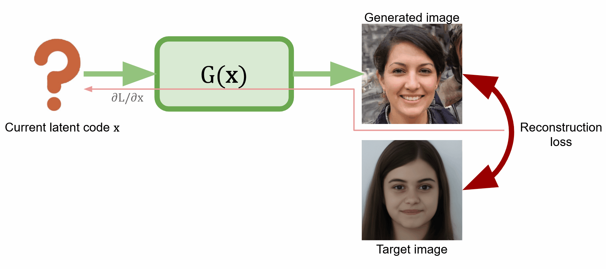

# Using GAN latent space for semantic photo editing
This repo contains the code for my masters thesis on face generation.
It explores the possibility of editing an image by projecting it into GAN latent space, then modifying its latent code
using some vector arithmetic, and finally generating modified image.

In this work I use StyleGAN (particularly [this](https://github.com/genforce/interfacegan) PyTorch implementation),
but I'm trying to make it independent of a generative network to be able to easily switch them out.

## Latent optimization
First step is to find corresponding latent code for the image. Since we can backpropagate gradients w.r.t. input vector 
throught generator network, we can directly optimize the latent code using some reconstruction loss function.
In this case it's a weighted sum of L2 loss in pixel space and L2 loss in feature space (that is, on some layer of pretrained VGG network).

## Editing in latent space
Then we need to find a certain direction, corresponding to a change in desired attribute.
After that we can linearly shift the latent vector 
 
to make this attribute more/less prominent.

Here
a) is input image,
b) shift direction is just a difference between a pair of images that differ in only one attribute,
c) shift direction is averaged over multiple pairs,
d) linear interpolation between *ground truth* images.

I use [FEI dataset](https://fei.edu.br/~cet/facedatabase.html) for this calculation.

## Edit different attributes

## Future plans
This approach doesen't particularly work for some atributes, especially for ones that are not binary.
So I'm thinking of the way to mask a part of an image and propagate this mask to the latent code, 
in order to do some style mixing between two images.